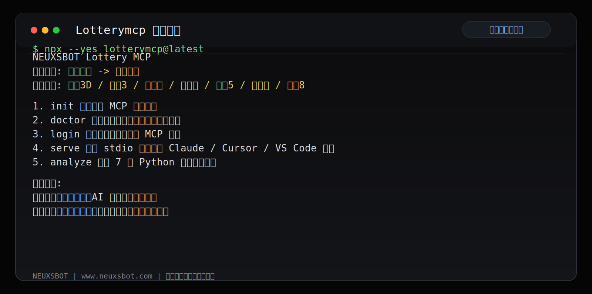
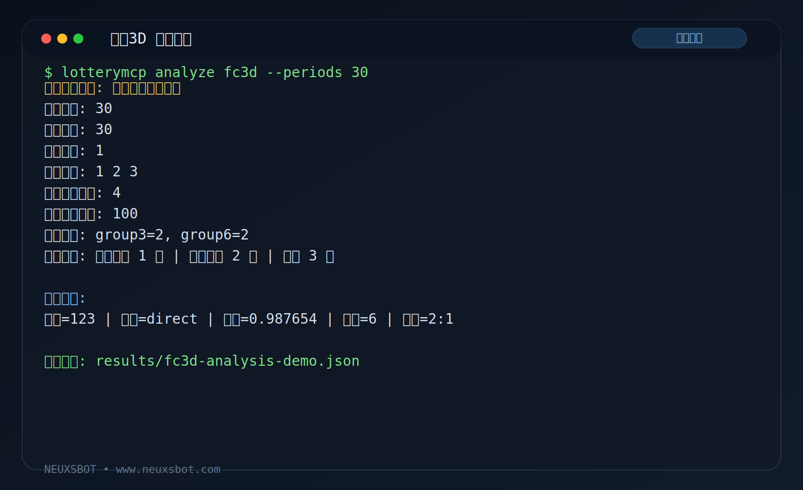
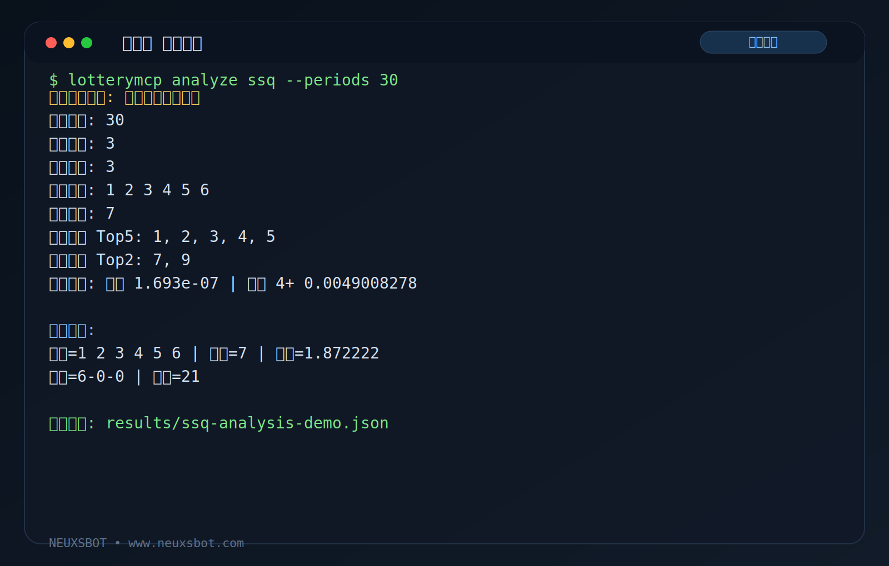
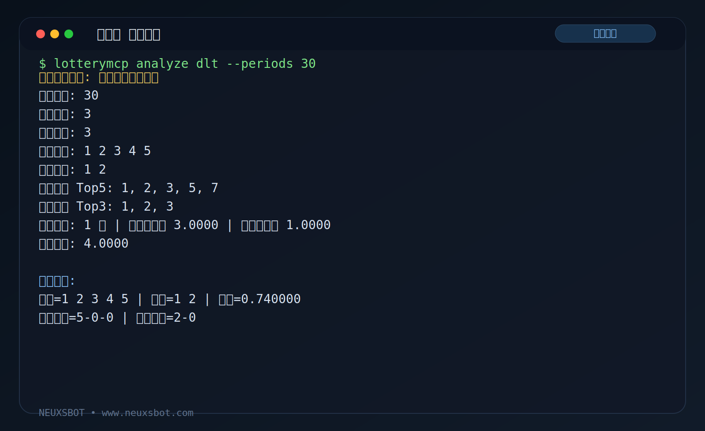

# Lotterymcp

Lotterymcp 是一个把真实彩票历史数据接入 MCP 客户端的开源工具。

它的作用很直接：把 NEUXSBOT 网站上的完整开奖历史接到 Claude Desktop、Cursor、VS Code 等支持 MCP 的 AI 工具里，让模型在对话中按你指定的彩种、期数和分析方向读取数据，再给出分析结果。

适合两类使用方式：

- 接入 Claude Desktop、Cursor、VS Code 等支持 MCP 的 AI 工具
- 直接运行仓库里的 Python 分析程序，本地联网取数后自行计算

快速入口：

- GitHub 快速开始：[docs/github-quickstart.zh-CN.md](docs/github-quickstart.zh-CN.md)
- MCP 接入说明：[docs/mcp-usage.zh-CN.md](docs/mcp-usage.zh-CN.md)
- 分析问题示例：[docs/prompt-templates.zh-CN.md](docs/prompt-templates.zh-CN.md)
- Python 本地分析程序：[examples/python/README.zh-CN.md](examples/python/README.zh-CN.md)

## 能做什么

- 在 AI 对话中动态读取福彩3D、排列3、双色球、大乐透、排列5、七星彩、快乐8等历史数据
- 让模型根据你指定的期数做冷热、频率、和值、跨度、分区、位置分布、重号、遗漏等分析
- 结合你自己的购买记录一起分析，不需要手工整理开奖数据
- 不接大模型时，也可以直接跑仓库里的 Python 分析程序

> 覆盖自历史首期至最新一期的完整准确数据，适合直接接入 AI 对话进行分析。

## 支持彩种

- 福彩3D：适合做三位数冷热、和值、跨度、组三/组六、两码命中等分析
- 排列3：适合做直选结构、号码分布、位置热度、回测验证等分析
- 双色球：适合做红球分区、蓝球热度、重号趋势、马尔科夫转移等分析
- 大乐透：适合做前区/后区分区、奇偶结构、候选组合筛选、组合评分等分析
- 排列5：适合做五位位置分布、和值区间、跨度变化、结构筛选等分析
- 七星彩：适合做七位号码结构、位置热度、区间组合、趋势摘要等分析
- 快乐8：适合做分区密度、奇偶比例、冷热号码、遗漏分布等分析

## 三步开始

1. 在 [NEUXSBOT 官网](https://www.neuxsbot.com) 注册或登录，并在 [个人中心](https://www.neuxsbot.com/member) 复制你的 MCP 密钥。
2. 运行 `npx --yes lotterymcp@latest` 打开中文菜单；如果要长期使用，再执行 `npm i -g lotterymcp`。
3. 填入接口地址、密钥和默认分析期数，复制生成的 MCP 配置片段到 Claude Desktop、Cursor、VS Code 等支持 MCP 的 AI 工具。

这个项目不是离线数据包。真实数据、权限状态和调用额度都由网站账号体系控制，本地 MCP 负责把这些能力接到 AI 工具里。

## 命令行实际效果

以下终端图按真实脚本风格重做，展示的是中文菜单、福彩3D逆向推演、双色球深度匹配和大乐透组合分析这几类实际输出结构。

<table>
  <tr>
    <td width="50%"></td>
    <td width="50%"></td>
  </tr>
  <tr>
    <td width="50%"></td>
    <td width="50%"></td>
  </tr>
</table>

## 通用 MCP 配置示例

```json
{
  "mcpServers": {
    "neuxsbot-cp": {
      "command": "npx",
      "args": ["-y", "lotterymcp@latest", "serve"],
      "env": {
        "NEUXSBOT_API_BASE_URL": "https://www.neuxsbot.com",
        "NEUXSBOT_TOKEN": "your-real-token",
        "NEUXSBOT_DEFAULT_PERIODS": "100"
      }
    }
  }
}
```

如果已经全局安装，也可以把 `command` 改成 `lotterymcp`，把 `args` 改成 `["serve"]`。

完整接入步骤见：[docs/mcp-usage.zh-CN.md](docs/mcp-usage.zh-CN.md)

## 分析问题示例

- 帮我分析最近 100 期福彩3D 的热号、冷号、和值和跨度。
- 帮我读取最近 120 期排列3，按百位、十位、个位分别做结构分析。
- 读取最近 120 期双色球历史数据，按红球三区、蓝球热度和重号趋势做总结。
- 帮我读取最近 100 期大乐透，前区和后区分开分析，并给出结构化结论。
- 读取最近 150 期排列5，按五个位置的热度和跨度变化做汇总。
- 读取最近 150 期七星彩，分析七位结构、和值区间和号码分布。
- 先读取最近 150 期快乐8 数据，再按分区、奇偶和遗漏情况做汇总。
- 结合我最近 20 次购买记录，再读取最近 120 期开奖，分析我的选号偏好。

更多可直接复制的问题示例见：[docs/prompt-templates.zh-CN.md](docs/prompt-templates.zh-CN.md)

## Python 本地分析程序

仓库里附带了 7 个联网取数的本地分析程序：

- `fc3d_markov`：福彩3D 分析程序
- `pl3_markov`：排列3 分析程序
- `ssq_quantum`：双色球分析程序
- `dlt_hybrid`：大乐透分析程序
- `pailie5_positional`：排列5 分析程序
- `select7_positional`：七星彩分析程序
- `kl8_frequency`：快乐8 分析程序

适合：

- 想直接跑算法脚本的人
- 想做二次开发的人
- 后续想自己打包成 EXE 的人

说明见：[examples/python/README.zh-CN.md](examples/python/README.zh-CN.md)

## 常见问题

### 1. 不注册能不能直接用

不能。你至少需要先拿到网站账号对应的 MCP 密钥，本地工具才能访问真实数据接口。

### 2. AI 里不写死彩种可以吗

可以。彩种、期数、分析方向都可以在对话里动态指定，不需要把某个彩种写死在配置中。

### 3. 返回 429 是什么问题

通常表示当前请求频率过高，或者账号额度触发限制。先降低分析期数和请求频率，再检查网站账号状态。

### 4. 不接模型能不能用

可以。你可以直接运行仓库里的 Python 分析程序，它们会联网读取历史数据后在本地计算。

## 公开仓库包含什么

公开仓库主要提供：

- 命令行接入入口
- MCP 本地代理能力
- 配置示例和接入文档
- 7 个 Python 本地分析程序示例

适合直接安装、接入 AI 工具、做本地分析，或者在现有基础上继续二次开发。
